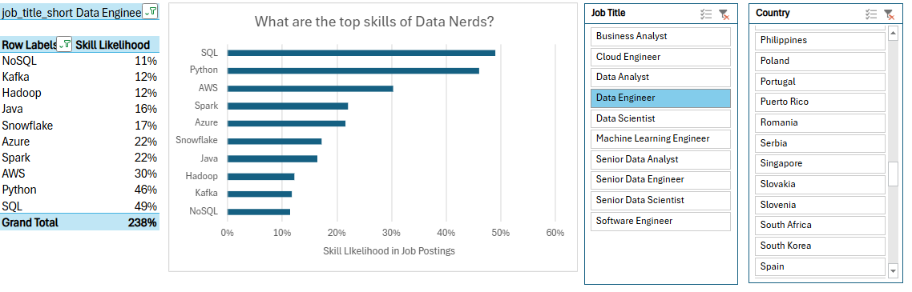
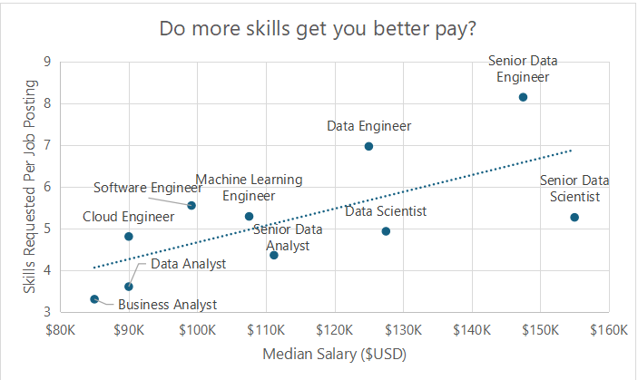
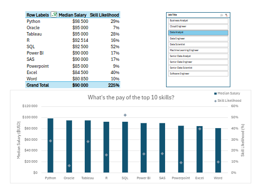
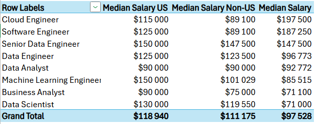

# 📊 Job Market Analysis Dashboard (Excel)

## Introduction

This project was completed while following **Luke Barousse's Excel for Data Analytics** course. As part of the guided project, I built an interactive Microsoft Excel dashboards to analyze the global data job market and strengthen my Excel data analysis skills.

These dashboards explore salary trends, identifies the most in-demand technical skills, and examines how different skills relate to compensation across various data careers. Using interactive Excel slicers, users can filter the analysis by job title and country to explore the data from different perspectives.

---

## Dataset

The dataset contains information about data-related job postings, including:

- Job Title
- Country
- Required Skills
- Median Salary
- US vs Non-US Salaries

---

# Dashboard 1 — Top Skills for Data Engineers

### Description

This dashboard analyzes the most frequently requested skills for **Data Engineer** positions.

Users can filter the results by:

- Job Title
- Country

### Insights

- SQL is the most requested skill (49%).
- Python is nearly as important (46%).
- AWS ranks third (30%).
- Azure and Spark each appear in about 22% of job postings.
- Snowflake, Java, Hadoop, Kafka, and NoSQL are valuable supporting technologies.

### Excel Features Used

- Pivot Table
- Horizontal Bar Chart
- Slicers
- Dynamic Filtering

---

# Dashboard 2 — Do More Skills Lead to Higher Pay?

### Description

This scatter chart compares:

- Median Salary
- Average Number of Skills Required

Each point represents a different job role.

### Insights

- Higher-paying jobs generally require more technical skills.
- Senior Data Engineer has both the highest salary and the highest average skill requirement.
- Business Analyst requires fewer technical skills and has one of the lowest median salaries.
- The positive trendline indicates a moderate positive relationship between required skills and salary.

### Excel Features Used

- Scatter Plot
- Trendline
- Dynamic Labels
- Pivot Table

---

# Dashboard 3 — Salary of the Top Skills

### Description

This dashboard compares the median salary associated with the most common technical skills.

The chart combines salary information with skill demand.

### Insights

- Python has the highest median salary.
- Oracle and Tableau are also among the highest-paying skills.
- SQL is the most demanded skill but not the highest-paying one.
- Excel and Word appear frequently but are associated with lower salaries.

### Excel Features Used

- Combo Chart
- Pivot Table
- Slicers
- Dual Axis Visualization

---

# Dashboard 4 — US vs Non-US Salary Comparison

### Description

This dashboard compares median salaries between the United States and other countries.

### Insights

- US salaries are generally higher across most job roles.
- Senior Data Engineer receives the highest compensation.
- Machine Learning Engineer also ranks among the highest-paying careers.
- Data Analyst salaries are relatively consistent across regions.

### Excel Features Used

- Pivot Table
- Salary Comparison
- Regional Analysis

---

# Skills Demonstrated

- Microsoft Excel
- Pivot Tables
- Pivot Charts
- Slicers
- Scatter Charts
- Combo Charts
- Data Visualization
- Dashboard Design
- Salary Analysis
- Skill Analysis

---

# Key Findings

- SQL and Python remain the most valuable skills for Data Engineers.
- Jobs requiring more technical skills generally offer higher salaries.
- Demand for a skill does not always translate into the highest salary.
- US-based positions typically offer significantly higher compensation than non-US positions.
- Interactive dashboards make it easy to explore salary and skill trends across different job roles.

---

---

